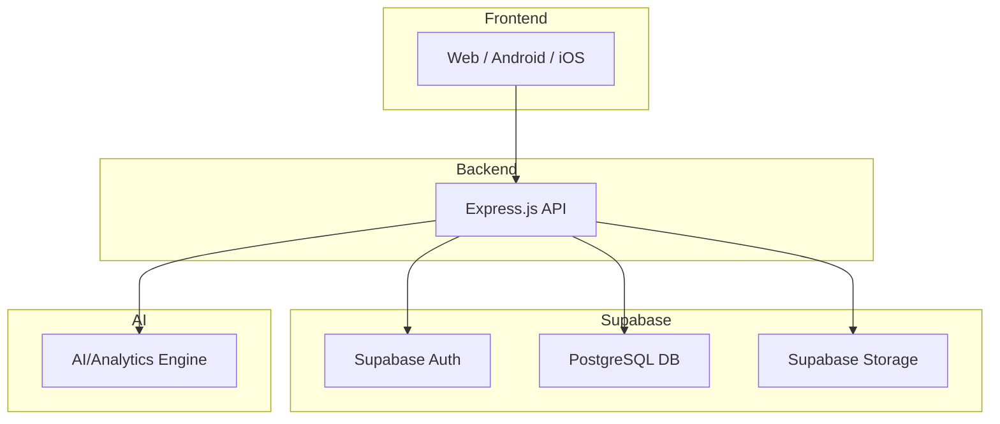
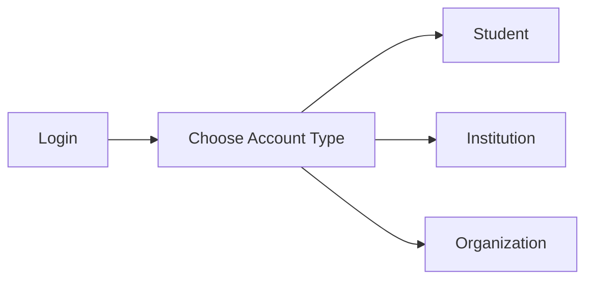
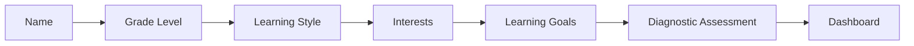
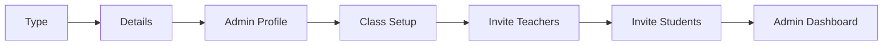
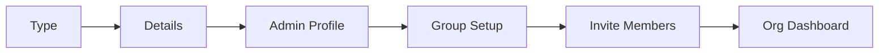
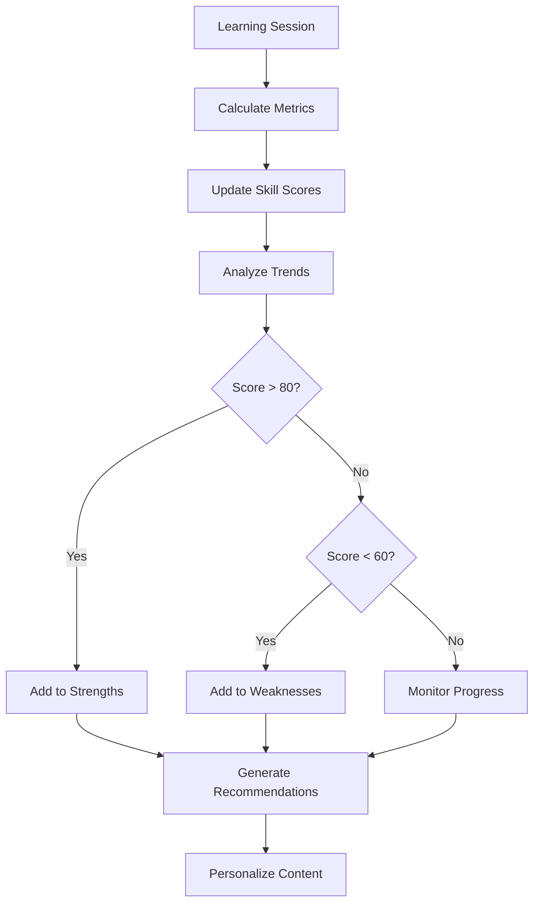

# Progress Tracking & Onboarding System Design

## Overview

This document outlines the architecture for tracking student progress, identifying strengths/weaknesses, and personalizing learning experiences using **Supabase as the data source** and **Express.js as the business logic layer**.

## Architecture Flow



## Current State Analysis

### Existing Implementation
- **Authentication**: Supabase Auth with Google OAuth, email/password, and guest access
- **Progress Tracking**: Basic `progress` table with XP, level, streaks, reading metrics
- **User Profile**: `users` table with display_name and preferences (language, theme, font, learningFocus)
- **Onboarding**: Single step for name collection, redirects to Settings for personalization

### Limitations
- No detailed skill tracking (reading comprehension, math skills, etc.)
- No institution/organization support
- No learning analytics for strengths/weaknesses
- No personalized content recommendations
- No group/class management

---

## Database Schema (Supabase PostgreSQL)

### Core Tables

#### 1. `users` (extends Supabase auth.users)
```sql
-- Already exists, will extend with:
ALTER TABLE users ADD COLUMN IF NOT EXISTS entity_type TEXT CHECK (entity_type IN ('student', 'institution', 'organization'));
ALTER TABLE users ADD COLUMN IF NOT EXISTS entity_id UUID;
```

#### 2. `skill_master` - Defines all skills in the system
```sql
CREATE TABLE skill_master (
    id UUID PRIMARY KEY DEFAULT gen_random_uuid(),
    category TEXT NOT NULL, -- 'reading', 'math', 'focus', 'writing'
    name TEXT NOT NULL, -- e.g., 'comprehension', 'vocabulary', 'algebra'
    description TEXT,
    created_at TIMESTAMP DEFAULT NOW()
);

-- Sample data:
-- Reading: comprehension, vocabulary, fluency, speed, retention
-- Math: arithmetic, algebra, geometry, problem_solving
-- Focus: attention_span, consistency, improvement_rate
-- Writing: grammar, creativity, structure
```

#### 3. `student_profiles`
```sql
CREATE TABLE student_profiles (
    user_id UUID PRIMARY KEY REFERENCES auth.users(id),
    grade_level TEXT,
    learning_style TEXT CHECK (learning_style IN ('visual', 'auditory', 'kinesthetic', 'reading_writing')),
    interests TEXT[],
    learning_pace TEXT CHECK (learning_pace IN ('slow', 'medium', 'fast')),
    created_at TIMESTAMP DEFAULT NOW(),
    updated_at TIMESTAMP DEFAULT NOW()
);
```

#### 4. `student_skill_scores` - Live profile with calculated scores
```sql
CREATE TABLE student_skill_scores (
    id UUID PRIMARY KEY DEFAULT gen_random_uuid(),
    user_id UUID REFERENCES auth.users(id),
    skill_id UUID REFERENCES skill_master(id),
    score NUMERIC(5,2), -- Current score (0-100)
    confidence NUMERIC(5,2), -- Confidence level in the score
    updated_at TIMESTAMP DEFAULT NOW(),
    UNIQUE(user_id, skill_id)
);
```

#### 5. `institutions`
```sql
CREATE TABLE institutions (
    id UUID PRIMARY KEY DEFAULT gen_random_uuid(),
    name TEXT NOT NULL,
    type TEXT CHECK (type IN ('school', 'college', 'university', 'training_center')),
    address TEXT,
    contact_email TEXT,
    settings JSONB, -- { "grade_levels": ["K-5", "6-8"], "subjects": ["math", "reading"] }
    created_at TIMESTAMP DEFAULT NOW()
);
```

#### 6. `institution_profiles`
```sql
CREATE TABLE institution_profiles (
    user_id UUID PRIMARY KEY REFERENCES auth.users(id),
    institution_id UUID REFERENCES institutions(id),
    role TEXT CHECK (role IN ('admin', 'teacher', 'student')),
    department TEXT,
    employee_id TEXT,
    created_at TIMESTAMP DEFAULT NOW()
);
```

#### 7. `organizations`
```sql
CREATE TABLE organizations (
    id UUID PRIMARY KEY DEFAULT gen_random_uuid(),
    name TEXT NOT NULL,
    type TEXT CHECK (type IN ('ngo', 'corporate', 'community', 'other')),
    description TEXT,
    contact_email TEXT,
    settings JSONB,
    created_at TIMESTAMP DEFAULT NOW()
);
```

#### 8. `organization_profiles`
```sql
CREATE TABLE organization_profiles (
    user_id UUID PRIMARY KEY REFERENCES auth.users(id),
    organization_id UUID REFERENCES organizations(id),
    role TEXT CHECK (role IN ('admin', 'member')),
    team TEXT,
    created_at TIMESTAMP DEFAULT NOW()
);
```

#### 9. `classes` (for institutions)
```sql
CREATE TABLE classes (
    id UUID PRIMARY KEY DEFAULT gen_random_uuid(),
    institution_id UUID REFERENCES institutions(id),
    name TEXT NOT NULL,
    code TEXT UNIQUE,
    description TEXT,
    teacher_id UUID REFERENCES auth.users(id),
    grade_level TEXT,
    subject TEXT,
    created_at TIMESTAMP DEFAULT NOW()
);
```

#### 10. `class_memberships`
```sql
CREATE TABLE class_memberships (
    id UUID PRIMARY KEY DEFAULT gen_random_uuid(),
    class_id UUID REFERENCES classes(id),
    student_id UUID REFERENCES auth.users(id),
    status TEXT CHECK (status IN ('active', 'inactive', 'completed')) DEFAULT 'active',
    joined_at TIMESTAMP DEFAULT NOW(),
    UNIQUE(class_id, student_id)
);
```

#### 11. `groups` (for organizations)
```sql
CREATE TABLE groups (
    id UUID PRIMARY KEY DEFAULT gen_random_uuid(),
    organization_id UUID REFERENCES organizations(id),
    name TEXT NOT NULL,
    description TEXT,
    admin_id UUID REFERENCES auth.users(id),
    created_at TIMESTAMP DEFAULT NOW()
);
```

#### 12. `group_memberships`
```sql
CREATE TABLE group_memberships (
    id UUID PRIMARY KEY DEFAULT gen_random_uuid(),
    group_id UUID REFERENCES groups(id),
    user_id UUID REFERENCES auth.users(id),
    role TEXT CHECK (role IN ('admin', 'member')) DEFAULT 'member',
    joined_at TIMESTAMP DEFAULT NOW(),
    UNIQUE(group_id, user_id)
);
```

#### 13. `learning_sessions`
```sql
CREATE TABLE learning_sessions (
    id UUID PRIMARY KEY DEFAULT gen_random_uuid(),
    user_id UUID REFERENCES auth.users(id),
    session_type TEXT CHECK (session_type IN ('reading', 'math', 'focus', 'writing')),
    content_id TEXT,
    duration_minutes INTEGER,
    metrics JSONB, -- { "words_per_minute": 120, "comprehension": 85, "focus_score": 78 }
    started_at TIMESTAMP DEFAULT NOW(),
    completed_at TIMESTAMP
);
```

#### 14. `skill_assessments`
```sql
CREATE TABLE skill_assessments (
    id UUID PRIMARY KEY DEFAULT gen_random_uuid(),
    user_id UUID REFERENCES auth.users(id),
    skill_category TEXT CHECK (skill_category IN ('reading', 'math', 'focus', 'writing')),
    skill_name TEXT, -- e.g., "vocabulary", "algebra", "comprehension"
    score INTEGER,
    max_score INTEGER,
    details JSONB, -- { "question_type": "multiple_choice", "time_taken": 45 }
    assessed_at TIMESTAMP DEFAULT NOW()
);
```

#### 15. `recommendations`
```sql
CREATE TABLE recommendations (
    id UUID PRIMARY KEY DEFAULT gen_random_uuid(),
    user_id UUID REFERENCES auth.users(id),
    type TEXT CHECK (type IN ('content', 'skill', 'challenge', 'reminder')),
    content_id TEXT,
    reason TEXT, -- Why this recommendation was made
    priority INTEGER CHECK (priority BETWEEN 1 AND 5),
    completed BOOLEAN DEFAULT FALSE,
    created_at TIMESTAMP DEFAULT NOW()
);
```

---

## Express.js API Endpoints

### Progress Analytics Engine

#### `POST /api/analytics/update-profile`
When a student completes an assessment:
```json
{
  "userId": "123",
  "skillCategory": "reading",
  "skillName": "comprehension",
  "score": 85,
  "maxScore": 100
}
```

Express.js logic:
1. Saves assessment to `skill_assessments`
2. Calculates averages
3. Updates `student_skill_scores`
4. Updates strengths/weaknesses in `student_profiles`
5. Generates recommendations

#### `GET /api/analytics/strengths/:userId`
Returns current strengths based on skill scores.

#### `GET /api/analytics/weaknesses/:userId`
Returns current weaknesses based on skill scores.

### Recommendation Engine

#### `POST /api/recommendations/generate`
Logic:
```javascript
if (readingScore < 60) {
   recommend("Reading Basics");
}
if (focusScore < 50) {
   recommend("Focus Training Session");
}
if (mathScore > 85) {
   recommend("Advanced Algebra");
}
```

#### `GET /api/recommendations/:userId`
Returns personalized learning recommendations.

### Learning Session Processing

#### `POST /api/sessions/complete`
When a session ends:
```json
{
  "userId": "123",
  "sessionType": "reading",
  "duration": 30,
  "wordsPerMinute": 140,
  "comprehension": 88
}
```

Express.js:
- Saves to `learning_sessions`
- Updates XP in `progress` table
- Updates streak
- Updates skill scores
- Generates recommendations

### Institution Management

#### `POST /api/institutions`
Create a new institution.

#### `GET /api/institutions/:id`
Get institution details.

#### `POST /api/classes`
Create a new class.

#### `GET /api/classes/:id/students`
Get students in a class.

#### `POST /api/classes/:id/join`
Join a class with code.

### Organization Management

#### `POST /api/organizations`
Create a new organization.

#### `POST /api/groups`
Create a new group.

#### `POST /api/groups/:id/invite`
Send invitation to join group.

#### `POST /api/groups/:id/join`
Join a group.

---

## Onboarding Flows

### Step 1: Entity Type Selection



### Student Onboarding (6 steps)



**Steps:**
1. `/onboarding/name` - Collect display name
2. `/onboarding/grade` - Grade level selection
3. `/onboarding/style` - Learning style assessment
4. `/onboarding/interests` - Subject interests
5. `/onboarding/goals` - Learning goals
6. `/onboarding/assessment` - Quick diagnostic quiz (reading, math, focus)
7. `/dashboard` - Personalized dashboard

### Institution Onboarding (6 steps)



**Steps:**
1. `/onboarding/institution-type` - School/College/Training Center
2. `/onboarding/institution-details` - Name, address, contact
3. `/onboarding/admin-profile` - Admin role, department
4. `/onboarding/class-setup` - Create classes/grade levels
5. `/onboarding/invite-teachers` - Email invites
6. `/onboarding/invite-students` - Bulk upload or invites
7. `/institution/dashboard` - Admin dashboard

### Organization Onboarding (5 steps)



**Steps:**
1. `/onboarding/organization-type` - NGO/Corporate/Community
2. `/onboarding/organization-details` - Name, description, contact
3. `/onboarding/admin-profile` - Admin role, team
4. `/onboarding/group-setup` - Create learning groups
5. `/onboarding/invite-members` - Email invites
6. `/organization/dashboard` - Admin dashboard

---

## Progress Tracking System

### How Progress is Tracked

1. **Learning Sessions**
   - Each interaction (reading, math, focus) creates a session
   - Metrics captured: duration, accuracy, speed, comprehension
   - Sessions stored in `learning_sessions` table

2. **Skill Assessments**
   - Periodic quizzes and challenges assess specific skills
   - Scores stored in `skill_assessments` table
   - Aggregated to `student_skill_scores`

3. **Strength/Weakness Detection Algorithm**



### Analytics Engine

The system analyzes:
- **Reading Skills**: comprehension, vocabulary, speed, retention
- **Math Skills**: arithmetic, algebra, geometry, problem-solving
- **Focus Skills**: attention span, consistency, improvement rate
- **Writing Skills**: grammar, creativity, structure

---

## Personalization Engine

### Recommendation Logic

```javascript
// Express.js backend logic
async function generateRecommendations(userId) {
  const skillScores = await getStudentSkillScores(userId);
  const recommendations = [];
  
  // For weaknesses: provide remedial content
  for (const skill of skillScores) {
    if (skill.score < 60) {
      recommendations.push({
        type: 'content',
        content_id: findRemedialContent(skill.skill_id, 'beginner'),
        reason: `Improve your ${skill.skill_name} skills`,
        priority: 5
      });
    }
    
    // For strengths: provide advanced challenges
    if (skill.score > 85) {
      recommendations.push({
        type: 'challenge',
        content_id: findAdvancedChallenge(skill.skill_id),
        reason: `Challenge your ${skill.skill_name} skills`,
        priority: 3
      });
    }
  }
  
  return recommendations;
}
```

### Personalization Factors

1. **Learning Style** - Visual, Auditory, Kinesthetic, Reading/Writing
2. **Pace Preference** - Slow, Medium, Fast
3. **Skill Level** - Beginner, Intermediate, Advanced
4. **Interests** - Topics the student enjoys
5. **Time Availability** - Daily goal minutes
6. **Progress Trends** - Improving, Declining, Stable

---

## Implementation Plan

### Phase 1: Database & Backend
- [ ] Create Supabase migration scripts
- [ ] Set up RLS policies
- [ ] Create Express.js API endpoints

### Phase 2: Student Onboarding
- [ ] Create onboarding step components
- [ ] Implement assessment logic
- [ ] Connect to progress tracking

### Phase 3: Institution/Organization Onboarding
- [ ] Create admin dashboards
- [ ] Implement invitation system
- [ ] Set up group/class management

### Phase 4: Personalization
- [ ] Build recommendation engine
- [ ] Integrate with content delivery
- [ ] Add progress insights

---

## Supabase Configuration

### Environment Variables Required
```
VITE_SUPABASE_URL=<your-supabase-url>
VITE_SUPABASE_ANON_KEY=<your-anon-key>
SUPABASE_SERVICE_ROLE_KEY=<service-role-key> # For server-side operations
```

### RLS Policies

```sql
-- Students can view their own data
CREATE POLICY "Students can view own profile"
ON student_profiles FOR SELECT
TO authenticated
USING (auth.uid() = user_id);

-- Institutions can view their members
CREATE POLICY "Institutions can view members"
ON class_memberships FOR SELECT
TO authenticated
USING (
  EXISTS (
    SELECT 1 FROM institution_profiles
    WHERE user_id = auth.uid()
    AND institution_id = (
      SELECT institution_id FROM classes WHERE id = class_memberships.class_id
    )
  )
);
```

---

## Next Steps

1. Review and approve this architecture
2. Create Supabase migration files
3. Implement Express.js API endpoints
4. Create onboarding UI components
5. Build analytics backend functions